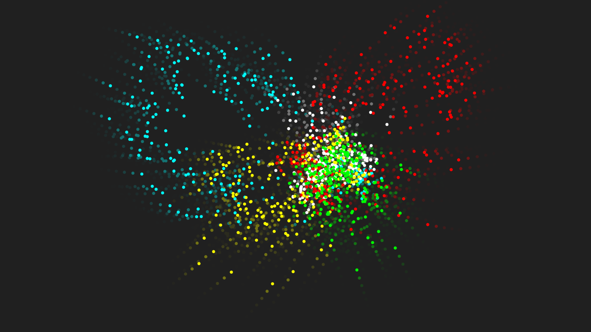

# js-olympic_particles
Particle animation where particles take the shape of the olympic rings I built using <a href="https://p5js.org/">p5.js</a>. I also use this as default proyect.
## URL
This proyect is hosted by github pages at <a href="https://pabloqb2000.github.io/js-olympic_particles/">this link</a>.
## Controls
Press any key to have the particles get attracted to your mouse.  
Click the mouse to spawn more particles.
## Screenshot
</img>
## References
To find more information about the <b>awesome</b> library used for this proyect visit:
<a href="https://p5js.org/"> https://p5js.org/ </a>
